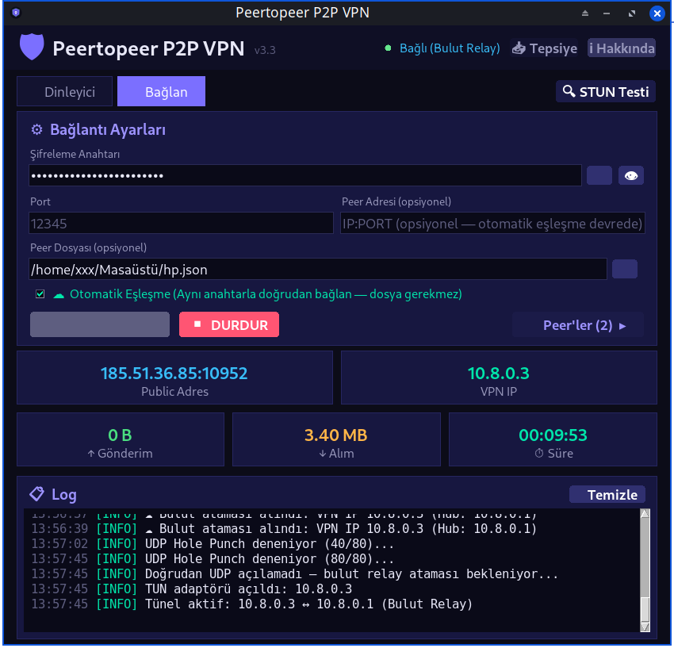
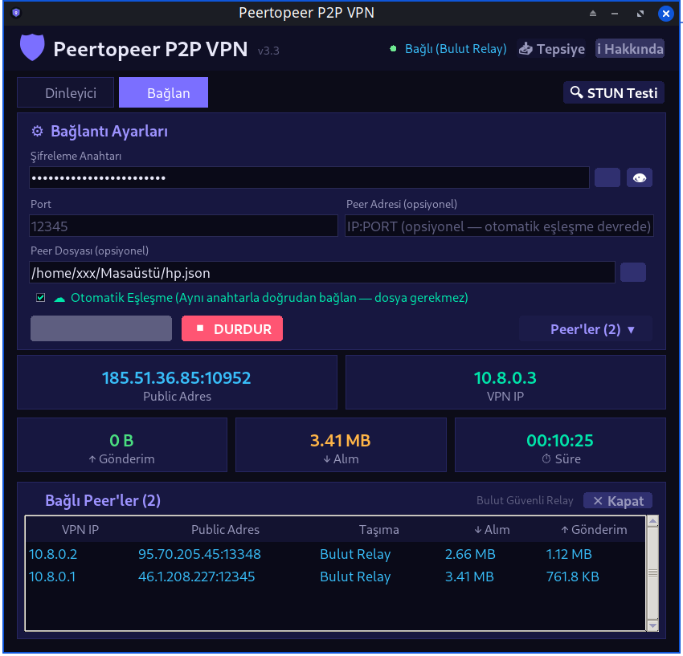

# 🛡️ Peertopeer P2P VPN

**VPS gerektirmeyen, uçtan uca şifreli, çoklu-peer P2P VPN** — tek dosyalık Python uygulaması, modern Tkinter arayüzü.

**VPS-free, end-to-end encrypted, multi-peer P2P VPN** — a single-file Python application with a modern Tkinter GUI.

> **Sürüm / Version:** `3.3`

[🇹🇷 Türkçe için tıklayın](#-türkçe) · [🇬🇧 Jump to English](#-english)

---

## 🇬🇧 English

### Overview

Peertopeer P2P VPN creates an encrypted peer-to-peer tunnel between machines **without a server (VPS)**.
The same application acts as both the listener (hub) and the connecting peer, and it supports
**multiple peers connected at the same time** through a hub-and-spoke topology.

It handles the hard part of NAT traversal automatically: STUN discovery, aggressive UDP hole
punching with port-delta prediction, and an encrypted cloud-relay fallback for double-CGNAT
situations where a direct UDP path is impossible.

### Features

- 🔗 **No VPS required** — direct peer-to-peer connection
- 🕳️ **CGNAT bypass** — STUN + aggressive UDP hole punching (port-delta prediction for symmetric NAT)
- ☁️ **Encrypted relay fallback** — when direct UDP fails, traffic is relayed through a public MQTT
  broker, still end-to-end encrypted (the broker only sees ciphertext)
- 👥 **Multi-peer support** — the listener (hub) accepts many peers at once and routes traffic
  between them in user space (no kernel forwarding / iptables needed)
- 📋 **Live peer list** — every peer sees all other connected machines (VPN IP, public address, transport)
- 🔐 **AES-256-GCM** encryption with PBKDF2-HMAC-SHA256 key derivation (480,000 iterations)
- 🖥️ **Real TUN adapter** — Wintun on Windows, `/dev/net/tun` on Linux
- 🎨 **Modern dark GUI** — dashboard, peer table, live log, system tray, About dialog
- 📦 **Single file** — `pertoper_vpn.py` contains everything (GUI + engine)
- 🔑 **Key sharing via peer file** — the exported JSON carries the encryption key so the client can
  just load the file instead of typing the key by hand

### How It Works

```
                 ┌──────────────────────────────┐
                 │   HUB (listener, 10.8.0.1)   │
                 └──────────────────────────────┘
                    ▲            ▲            ▲
        direct UDP  │            │ direct UDP │  relay (MQTT)
                    │            │            │
             ┌──────┴───┐  ┌─────┴────┐  ┌────┴─────┐
             │ Peer A   │  │ Peer B   │  │ Peer C   │
             │10.8.0.2  │  │10.8.0.3  │  │10.8.0.4  │
             └──────────┘  └──────────┘  └──────────┘
```

1. Both sides derive the same **room ID** from the shared key (`sha256(key)[:16]`).
2. They meet on a public MQTT broker and exchange their public endpoints.
3. **STUN** discovers each side's public IP:port and NAT behaviour (cone vs. symmetric).
4. **UDP hole punching** is attempted with retries and port-delta prediction.
5. If direct UDP fails, traffic falls back to the **encrypted MQTT relay**.
6. While on relay, a background probe keeps trying to **upgrade to direct P2P**.
7. The hub assigns each peer a VPN IP (`10.8.0.2` … `10.8.0.254`) and routes packets between
   peers in user space; the routing table is also broadcast to every peer for display.

### Screenshots

**Main window — client connected, peers panel collapsed**



**Connected peers — every machine sees the others**

The hub assigns each peer its own VPN IP. The **Taşıma / Transport** column shows whether that
peer is reached directly over UDP (`Doğrudan P2P`) or through the encrypted cloud relay
(`Bulut Relay`).



### Requirements

- Python 3.8+
- `cryptography`, `pystray`, `pillow` (see [`requirements.txt`](requirements.txt))
- **Administrator / root privileges** (to create the TUN adapter)
- **Windows:** [`wintun.dll`](https://www.wintun.net) placed next to the script

### Installation

```bash
git clone https://github.com/<your-username>/<your-repo>.git
cd <your-repo>

# (recommended) virtual environment
python -m venv .venv
# Windows:  .venv\Scripts\activate
# Linux:    source .venv/bin/activate

pip install -r requirements.txt
```

**Windows only:** download `wintun.dll` from <https://www.wintun.net> and place it in the project
folder (next to `pertoper_vpn.py`).

### Usage

Run with administrator/root privileges:

```bash
# Windows (as Administrator)
python pertoper_vpn.py

# Linux (root or auto-elevates via pkexec)
sudo python pertoper_vpn.py
```

**On the hub machine (server)**

1. Select the **📡 Dinleyici / Listener** mode.
2. Enter a **shared secret key** (click 🎲 to generate one and copy it to the clipboard).
3. Optionally set the **port** (default `12345`) and an **export file** to save `peer_info.json`.
4. Click **🚀 BAŞLAT / START**.

**On each connecting machine (client)**

1. Select the **🔗 Bağlan / Connect** mode.
2. Either type the **same secret key**, or load the exported `peer_info.json` with 📂 —
   the key is read from the file automatically.
3. Click **🚀 BAŞLAT / START**.
4. Click **👥 Peer'ler / Peers** to open the list of connected machines.

Both sides must use **the same secret key** and be able to reach the same MQTT brokers.

### Building a Standalone Binary

**Linux**

```bash
./build.sh
# output: dist/linux/PertoperVPN
```

**Windows**

```bat
build.bat
:: interactive menu:
::   [1] Windows (.exe)   ->  dist\windows\PertoperVPN.exe
::   [2] Linux (ELF)      ->  dist\linux\PertoperVPN
::   [3] Both
```

### Sharing the Peer File

When the hub exports `peer_info.json`, the file contains the public endpoint **and** the shared key:

```json
{
  "public_ip": "203.0.113.10",
  "public_port": 41337,
  "vpn_ip": "10.8.0.1",
  "nat_type": "Cone NAT (Hole Punch Uyumlu)",
  "key": "your-shared-secret-key"
}
```

⚠️ **The file contains the key in plain text.** Send it over a secure channel only.

### Project Structure

```
pertoper_vpn.py     # entire application (GUI + VPN engine)
requirements.txt    # Python dependencies
build.sh            # Linux build script (PyInstaller)
build.bat           # Windows / Linux build menu (PyInstaller)
pertoper_vpn.ico    # application icon (Windows)
pertoper_vpn.png    # application icon (Linux / tray)
screenshots/        # screenshots used in this README
README.md
```

### Troubleshooting

| Problem | Solution |
| --- | --- |
| `TUN hatası` / TUN adapter error | Run as Administrator / root |
| `wintun.dll bulunamadı` (Windows) | Download `wintun.dll` next to `pertoper_vpn.py` |
| Connection never establishes | Make sure the key matches on both sides and the port is not blocked |
| Always falls back to relay | Both sides are likely behind symmetric CGNAT; relay still works, but slower |
| Linux icon missing in taskbar | A `.desktop` entry is installed automatically on startup; if needed run `xfce4-panel -r` |
| `cryptography` import error | `pip install -r requirements.txt` |

### Security Notes

- Traffic is encrypted with **AES-256-GCM**; the relay broker only sees ciphertext.
- The **key is the only authentication factor** — anyone who knows it can join the network.
  Use a long, random key (the 🎲 button generates a 24-character one).
- Public MQTT brokers are used for rendezvous/relay. They can observe *that* a session exists
  (encrypted metadata, topic derived from the key), but not the content.
- **This project is for educational and personal use.** You are responsible for complying with
  the laws and network policies that apply to you.

### Developer

**Bekir Alişoğlu** — ✉️ alisoglu@yahoo.com

### License

No license file has been added to this repository yet. Without a license, the default is
"all rights reserved". If you intend to make this project open source, add a `LICENSE` file
(e.g. [MIT](https://choosealicense.com/licenses/mit/)).

---

## 🇹🇷 Türkçe

### Genel Bakış

Peertopeer P2P VPN, makineler arasında **sunucu (VPS) gerektirmeden** şifreli bir peer-to-peer tüneli
kurar. Aynı uygulama hem dinleyici (hub) hem de bağlanan taraf olarak çalışır ve **hub-and-spoke**
topolojisiyle **aynı anda birden fazla peer** bağlanmasını destekler.

NAT geçişinin zor kısmını otomatik halleder: STUN keşfi, port-delta tahminli agresif UDP hole
punching ve doğrudan UDP yolunun mümkün olmadığı çift CGNat durumlarında şifreli bulut relay
yedek yolu.

### Özellikler

- 🔗 **VPS gerektirmez** — doğrudan peer-to-peer bağlantı
- 🕳️ **CGNat bypass** — STUN + agresif UDP hole punching (simetrik NAT için port-delta tahmini)
- ☁️ **Şifreli relay yedeği** — doğrudan UDP başarısız olursa trafik bir genel MQTT broker üzerinden
  aktarılır, yine uçtan uca şifreli (broker yalnızca şifreli metni görür)
- 👥 **Çoklu peer desteği** — dinleyici (hub) aynı anda birçok peer kabul eder ve trafiği kullanıcı
  alanında yönlendirir (kernel forwarding / iptables gerekmez)
- 📋 **Canlı peer listesi** — her peer, bağlı tüm makineleri görür (VPN IP, public adres, taşıma tipi)
- 🔐 **AES-256-GCM** şifreleme, PBKDF2-HMAC-SHA256 anahtar türetimi (480.000 iterasyon)
- 🖥️ **Gerçek TUN adaptörü** — Windows'ta Wintun, Linux'ta `/dev/net/tun`
- 🎨 **Modern koyu arayüz** — gösterge paneli, peer tablosu, canlı log, sistem tepsisi, Hakkında penceresi
- 📦 **Tek dosya** — `pertoper_vpn.py` her şeyi içerir (arayüz + çekirdek)
- 🔑 **Peer dosyasıyla anahtar paylaşımı** — dışa aktarılan JSON şifreleme anahtarını da taşır; istemci
  anahtarı elle yazmak yerine dosyayı yükler

### Nasıl Çalışır?

```
                 ┌──────────────────────────────┐
                 │   HUB (dinleyici, 10.8.0.1)  │
                 └──────────────────────────────┘
                    ▲            ▲            ▲
       doğrudan UDP │            │ doğrudan   │  relay (MQTT)
                    │            │ UDP        │
             ┌──────┴───┐  ┌─────┴────┐  ┌────┴─────┐
             │ Peer A   │  │ Peer B   │  │ Peer C   │
             │10.8.0.2  │  │10.8.0.3  │  │10.8.0.4  │
             └──────────┘  └──────────┘  └──────────┘
```

1. İki taraf paylaşılan anahtardan aynı **oda kimliğini** üretir (`sha256(key)[:16]`).
2. Bir genel MQTT broker üzerinde buluşup kendi public adreslerini paylaşırlar.
3. **STUN** ile her tarafın public IP:port bilgisi ve NAT davranışı (cone / simetrik) tespit edilir.
4. Tekrarlı ve port-delta tahminli **UDP hole punching** denenir.
5. Doğrudan UDP başarısız olursa trafik **şifreli MQTT relay**'ine düşer.
6. Relay'deyken arka plan yoklaması **doğrudan P2P'ye yükseltmeyi** sürdürür.
7. Hub her peer'e bir VPN IP'si atar (`10.8.0.2` … `10.8.0.254`) ve paketleri kullanıcı alanında
   peer'ler arasında yönlendirir; yönlendirme tablosu görüntüleme için tüm peer'lere de yayınlanır.

### Ekran Görüntüleri

**Ana pencere — istemci bağlı, peer paneli kapalı**


**Bağlı peer'ler — her makine diğerlerini görür**

Hub her peer'e kendi VPN IP'sini atar. **Taşıma** sütunu, o peer'e doğrudan UDP ile mi
(`Doğrudan P2P`) yoksa şifreli bulut relay'i üzerinden mi (`Bulut Relay`) ulaşıldığını gösterir.


### Gereksinimler

- Python 3.8+
- `cryptography`, `pystray`, `pillow` (bkz. [`requirements.txt`](requirements.txt))
- **Yönetici / root yetkisi** (TUN adaptörü oluşturmak için)
- **Windows:** script'in yanına konulmuş [`wintun.dll`](https://www.wintun.net)

### Kurulum

```bash
git clone https://github.com/<kullanici-adiniz>/<repo-adiniz>.git
cd <repo-adiniz>

# (önerilir) sanal ortam
python -m venv .venv
# Windows:  .venv\Scripts\activate
# Linux:    source .venv/bin/activate

pip install -r requirements.txt
```

**Yalnızca Windows:** <https://www.wintun.net> adresinden `wintun.dll` indirip proje klasörüne
(`pertoper_vpn.py` ile aynı dizine) koyun.

### Kullanım

Yönetici/root yetkisiyle çalıştırın:

```bash
# Windows (Yönetici olarak)
python pertoper_vpn.py

# Linux (root veya pkexec ile otomatik yükseltme)
sudo python pertoper_vpn.py
```

**Hub makinede (sunucu)**

1. **📡 Dinleyici** modunu seçin.
2. Bir **şifreleme anahtarı** girin (🎲 ile üretip panoya kopyalayabilirsiniz).
3. İsteğe bağlı olarak **port** (varsayılan `12345`) ve `peer_info.json` için **Dışa Aktar** dosyası belirleyin.
4. **🚀 BAŞLAT** butonuna basın.

**Bağlanan her makinede (istemci)**

1. **🔗 Bağlan** modunu seçin.
2. **Aynı anahtarı** yazın ya da 📂 ile dışa aktarılan `peer_info.json` dosyasını seçin —
   anahtar dosyadan otomatik okunur.
3. **🚀 BAŞLAT** butonuna basın.
4. Bağlı makineleri görmek için **👥 Peer'ler** butonuna basın.

İki taraf da **aynı anahtarı** kullanmalı ve aynı MQTT broker'larına erişebilmelidir.

### Tek Dosya (Binary) Derleme

**Linux**

```bash
./build.sh
# çıktı: dist/linux/PertoperVPN
```

**Windows**

```bat
build.bat
:: etkileşimli menü:
::   [1] Windows (.exe)   ->  dist\windows\PertoperVPN.exe
::   [2] Linux (ELF)      ->  dist\linux\PertoperVPN
::   [3] Her ikisi
```

### Peer Dosyası Paylaşımı

Hub `peer_info.json` dosyasını dışa aktardığında dosya, public adresin yanı sıra **paylaşılan anahtarı**
da içerir:

```json
{
  "public_ip": "203.0.113.10",
  "public_port": 41337,
  "vpn_ip": "10.8.0.1",
  "nat_type": "Cone NAT (Hole Punch Uyumlu)",
  "key": "paylasilan-gizli-anahtar"
}
```

⚠️ **Dosya anahtarı düz metin olarak içerir.** Yalnızca güvenli bir kanaldan gönderin.

### Proje Yapısı

```
pertoper_vpn.py     # tüm uygulama (arayüz + VPN çekirdeği)
requirements.txt    # Python bağımlılıkları
build.sh            # Linux derleme betiği (PyInstaller)
build.bat           # Windows / Linux derleme menüsü (PyInstaller)
pertoper_vpn.ico    # uygulama simgesi (Windows)
pertoper_vpn.png    # uygulama simgesi (Linux / tepsi)
screenshots/        # bu README'de kullanılan ekran görüntüleri
README.md
```

### Sorun Giderme

| Sorun | Çözüm |
| --- | --- |
| `TUN hatası` | Yönetici / root olarak çalıştırın |
| `wintun.dll bulunamadı` (Windows) | `wintun.dll` dosyasını `pertoper_vpn.py` yanına indirin |
| Bağlantı hiç kurulmuyor | İki tarafta anahtarın aynı olduğundan ve portun engelli olmadığından emin olun |
| Sürekli relay'e düşüyor | İki taraf da simetrik CGNat arkasında olabilir; relay yine çalışır ama daha yavaştır |
| Linux'ta görev çubuğu simgesi yok | Açılışta `.desktop` kaydı otomatik kurulur; gerekirse `xfce4-panel -r` çalıştırın |
| `cryptography` bulunamadı | `pip install -r requirements.txt` |

### Güvenlik Notları

- Trafik **AES-256-GCM** ile şifrelenir; relay broker'ı yalnızca şifreli metni görür.
- **Tek kimlik doğrulama faktörü anahtardır** — bilen herkes ağa katılabilir. Uzun ve rastgele bir
  anahtar kullanın (🎲 butonu 24 karakterlik anahtar üretir).
- Buluşma/relay için genel MQTT broker'ları kullanılır. Bir oturumun *var olduğu* gözlemlenebilir
  (şifreli meta veri, konu adı anahtardan türetilir) ancak içerik görülemez.
- **Bu proje eğitim ve kişisel kullanım içindir.** Bulunduğunuz yerdeki yasalara ve ağ
  politikalarına uymak sizin sorumluluğunuzdadır.

### Geliştirici

**Bekir Alişoğlu** — ✉️ alisoglu@yahoo.com

### Lisans

Bu depoya henüz bir lisans dosyası eklenmemiştir. Lisans olmadan varsayılan durum
"tüm hakları saklıdır"dır. Projeyi açık kaynak yapmak istiyorsanız bir `LICENSE` dosyası ekleyin
(örn. [MIT](https://choosealicense.com/licenses/mit/)).
